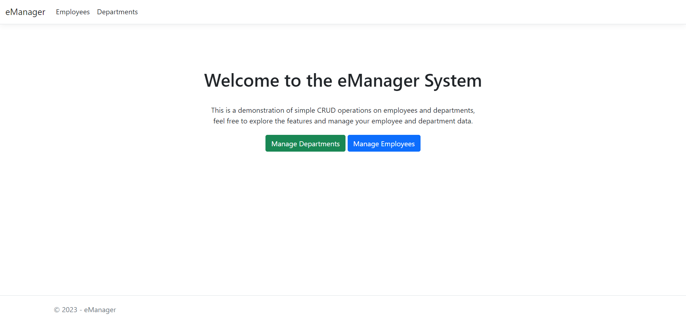
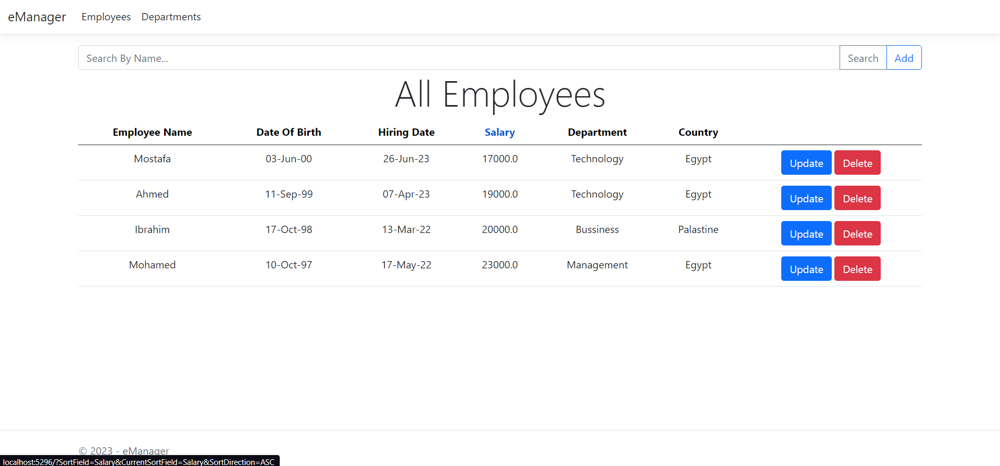
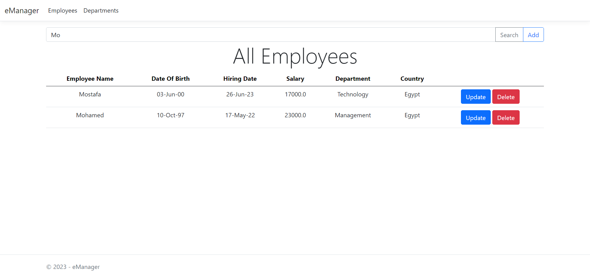

# eManager

eManager is a simple demonstration for efficient management of employees and departments.

## Features

- **CRUD Operations**: Easily add, view, update, and delete Employee & Departments records.
- **Sortable Columns**: Click on the column headers in the employee or department list to sort the data by that field. Ascending and descending sorting is supported.
- **Search by Name**: Effortlessly search for employees or departments by name. Simply enter the name in the search box to filter results.
- **User-Friendly Interface**: Intuitive and responsive design for a seamless user experience.


## Getting Started

### Prerequisites

- ASP.NET 8.0
- Microsoft.EntityFrameworkCore.Sqlite
- Microsoft.EntityFrameworkCore.Design

### Usage

- Clone the repository: 
    ```
    git clone https://github.com/mustashrf/eManager.git
    ```
- Navigate to the project directory: 
    ```
    cd eManager
    ```
- Install required packages:
    ```
    dotnet tool install --global dotnet-ef
    dotnet add package Microsoft.EntityFrameworkCore.Design
    dotnet add package Microsoft.EntityFrameworkCore.Sqlite
    ```
- Make migrations and update the database:
    ```
    dotnet ef migrations add InitialCreate
    dotnet ef database update
    ```
- Run:
   ```
   dotnet watch
   ```

## Screenshots


### Home Page


### Sortable Columns


### Search By Name
